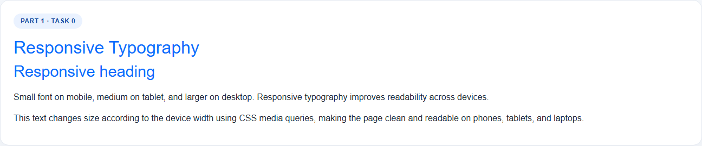
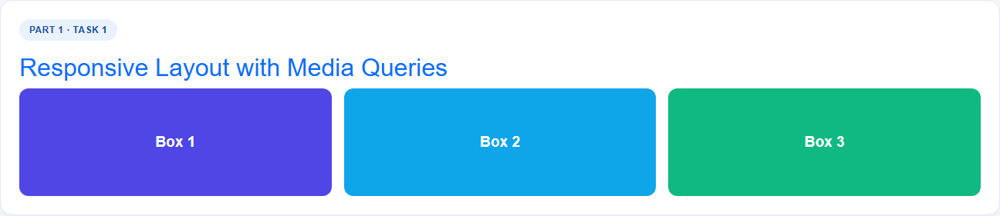
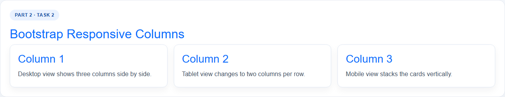
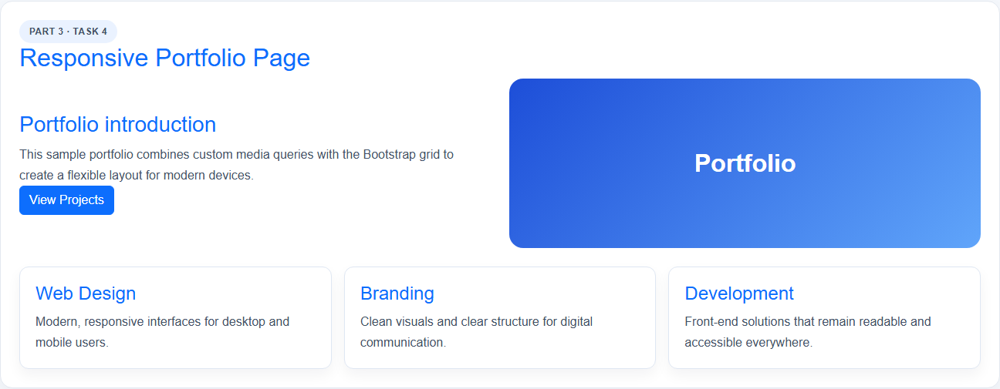

# Assignment #3: Responsive Web Design (Media Queries + Bootstrap Grid)

## Student Name
Your Name

## Group
Web1

## GitHub Repository
Add your public GitHub repository link here after uploading the project.

## Tasks Included

### Part 1 · Task 0: Responsive Typography

### Part 1 · Task 1: Responsive Layout with Media Queries

### Part 2 · Task 2: Bootstrap Responsive Columns

### Part 2 · Task 3: Bootstrap Navigation Bar

### Part 3 · Task 4: Responsive Portfolio Page

## Summary of Work Process

1. I created a single responsive assignment page with all required sections.
2. I used CSS media queries to adjust typography and layout for mobile, tablet, and desktop screens.
3. I used Bootstrap's 12-column grid to build the responsive column layout.
4. I added a Bootstrap navigation bar with a logo, right-aligned links, and the mobile hamburger menu.
5. I combined the media-query layout and Bootstrap grid in a portfolio section to satisfy the final task.
6. I generated screenshots for each task and organized them in the screenshots folder.

## Notes
- The page is written with plain HTML, CSS, and Bootstrap CDN.
- The project is intended to run as a static website.
- Screenshots are stored in the screenshots folder for the report.
# web-3
